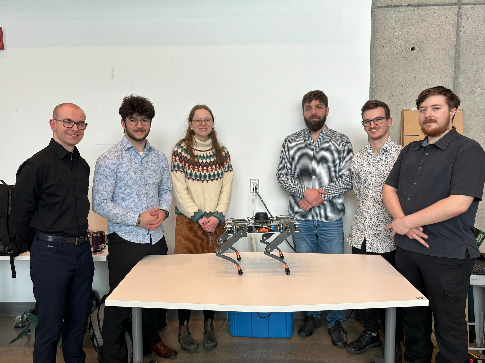

# Alpha-Bear-Omega-3 ($\alpha-$:bear: $-\Omega-\pi$)

[](http://makeapullrequest.com) [](https://opensource.com/resources/what-open-source) [](https://opensource.org/licenses/MIT)

$\alpha-$:bear: $-\Omega-\pi$ | The **better-ish**(?) quadruped robot | UdeS-GRO-68

Inspired by project [QuadrUS](https://github.com/olivierfournier2/S4H2021-QuadrUS), Boston Dynamics' [Spot](https://bostondynamics.com/products/spot/) and MIT's [mini cheetah](https://news.mit.edu/2019/mit-mini-cheetah-first-four-legged-robot-to-backflip-0304),  $\alpha-$:bear: $-\Omega-\pi$ is a quadruped robot bear made by six robotics engineering students from [Université de Sherbrooke](https://www.usherbrooke.ca/).

## Original Contributors



**From left to right:**

[Marc-Olivier Fecteau](https://github.com/MarcOlivierFecteau)  
[Hubert Houle](https://github.com/Hubert-Houle)  
[Justine Landry](https://github.com/justinelandry2)  
[Jonathan Perron](https://github.com/JPerron774)  
[Alex Jacques](https://github.com/AlexJacquesUS)  
[Thomas-Xavier Guimont](https://github.com/Revixa1)  

### A word from the authors

> We could say that when we chose to make a quadruped robot from scratch in 12 weeks, we wanted to prove to ourselves that we could achieve anything by working together, but we really just wanted to make something cool, and when brainstorming, the idea of a robot bear came up. Why a bear? Because bears can't be intimidated by dogs; thenceforth, robot bears are inherently better.

## Final product


## Table of contents

- [Development environment](#development-environment)
  - [Pre-requisites](#pre-requisites)
  - [Dependencies installation](#dependencies-installation)
  - [Using the installation script](#using-the-installation-script)
- [Robot environment](#robot-environment)
  - [System requirements](#system-requirements)
  - [Packages](#rpi-packages)
  - [Setup SSH](#setup-ssh)

## Development environment

### Pre-requisites

#### Operating system

- [Ubuntu 20.04 LTS](https://releases.ubuntu.com/focal/)

#### Packages

***N.B.*** The [installation script](#using-the-installation-script) installs most of the required packages. It is recommended to first run the script, and then [install the missing dependencies](#dependencies-installation).

- [ROS Noetic](http://wiki.ros.org/noetic/Installation/Ubuntu)
- Rviz: choose `Desktop-Full Install` option when installing ROS
- [CHAMP | champ](https://github.com/chvmp/champ)
- [CHAMP | champ setup assistant](https://github.com/chvmp/champ_setup_assistant)
- [Webots](https://cyberbotics.com/)
- [ROS Joy](http://wiki.ros.org/joystick_drivers)

### Dependencies installation

- Go to [ros-noetic installation page](https://wiki.ros.org/noetic/Installation/Ubuntu) and install ros-noetic.

- Install all dependencies for kinematics:

```bash
sudo apt install python3-pip ros-noetic-joy ros-noetic-rosserial ros-noetic-rosserial-python ros-noetic-rosserial-arduino
```

- Install all depencies for control:

```bash
sudo apt install ros-noetic-ros-control ros-noetic-robot-state-publisher ros-noetic-control-msgs
```

### Using the installation script

 ***N.B.*** Cloning the repository and using the installation script, a **catkin workspace** is initialized, so there's no need to do this procedure.

Choose the directory you want the project cloned into (`~` by default):

```bash
cd ~/<path_to_directory>
```

Then, type:

```bash
git clone --recursive https://github.com/TeamdEnfer/Alpha-Bear-Omega-3.git
```

Then, go into the project repository, launch the install script, and choose what you want to install (`all` option is recommended for first install):

```bash
cd Alpha-Bear-Omega-3
source install.sh
```

Finally, go into the **catkin workspace** and build the ROS workspace:

```bash
cd control/ros_ws
catkin_make
```

The ROS environment should now be set up and ready to work with.

Project setup notes:

> - Every time a non-`.launch` file is modified, do `catkin_make` in the **ros_ws** directory to update the executables.
> - Every time a new terminal is opened, run the `source ./install.sh` script with option `6` to source the ROS setup files. Alternatively, add the command to the `.bashrc` file to automate the process.

## Robot environment

### System requirements

- RaspberryPi 4 (Tested with 8GB RAM)
- [Ubuntu 20.04 LTS](https://releases.ubuntu.com/focal/) (Tested with Server install)

&emsp;***Authors note:*** though we recommend installing Ubuntu Server on the RPi 4, our experience with tha installation was "painful and full of adventures". Good luck!

### RPi Packages

- [ROS Noetic](http://wiki.ros.org/noetic/Installation/Ubuntu)

### Setup SSH

- [Setup RPi as Wi-Fi access point](https://gist.github.com/ExtremeGTX/ea1d1c12dde8261b263ab2fead983dc8)

To access the RPi, type:

```bash
ssh <RPi_name>@<RPi_access_point>
```
